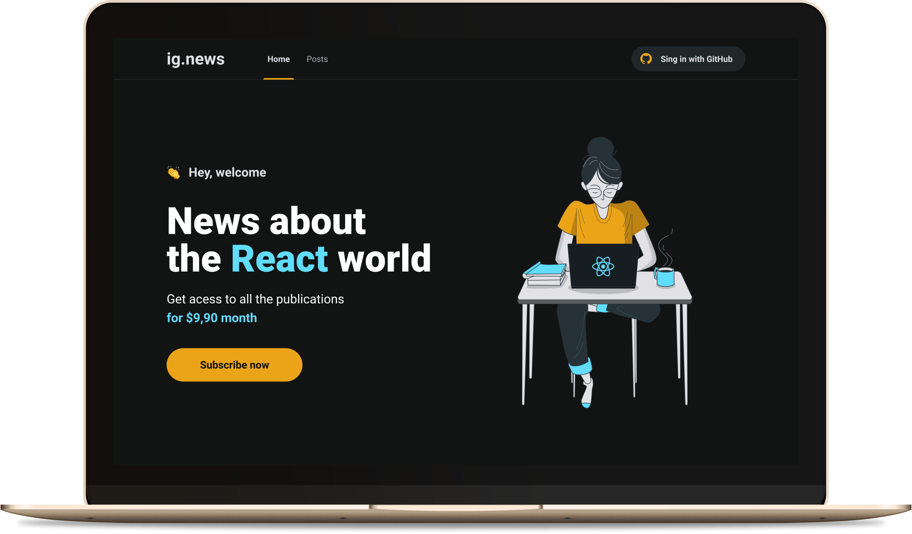

<h1 align="center">
  
</h1>

<h3 align="center">
  Stay informed about the ReactJS world
</h3>

<p align="center">
  
</p>

## 👩‍💻 About the project

Ignews is a project made in the third module of the Ignite Bootcamp providaded by @Rocketseat, i'm coursing the React track, where in the third module we create a complete blog using NextJS. Applying concepts like Server Side Rendering, CMS, Auth, Payments and more.

## 🚀 Technologies

- [Next.js](https://nextjs.org/)
- [ReactJS](https://reactjs.org/)
- [TypeScript](https://www.typescriptlang.org/)
- [Prismic](https://prismic.io/)
- [Stripe](https://stripe.com/en-br)
- [Faunadb](https://fauna.com/)
- [SASS](https://sass-lang.com/)

## 💻 Getting started

### Requirements

- [Node.js](https://nodejs.org/en/)
- [Yarn](https://classic.yarnpkg.com/) or [NPM](https://www.npmjs.com/) _(examples are with yarn)_

**Clone the project and access the folder**

```bash
$ git clone https://github.com/lucasoliveiraa/ignews.git
```

**Follow the steps below**

```bash
# Install the dependencies
$ yarn
# Make a copy of '.env.example' to '.env.local'
# and set with YOUR environment variables.
# Start the app
$ yarn dev
```

---

<p align="center">
  Made with 💜 by <a href="https://www.linkedin.com/in/lucas-da-costa-oliveira-b75b30125/">Lucas Oliveira</a>
</p>